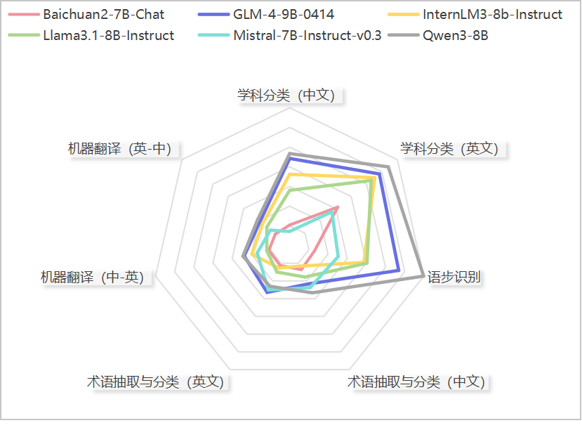
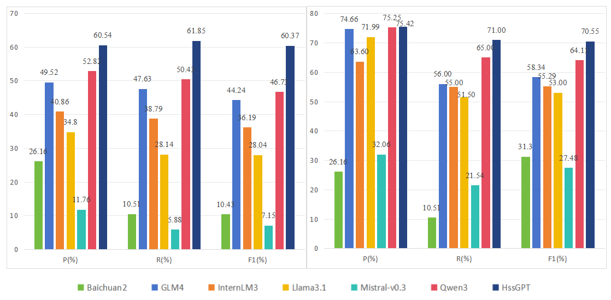
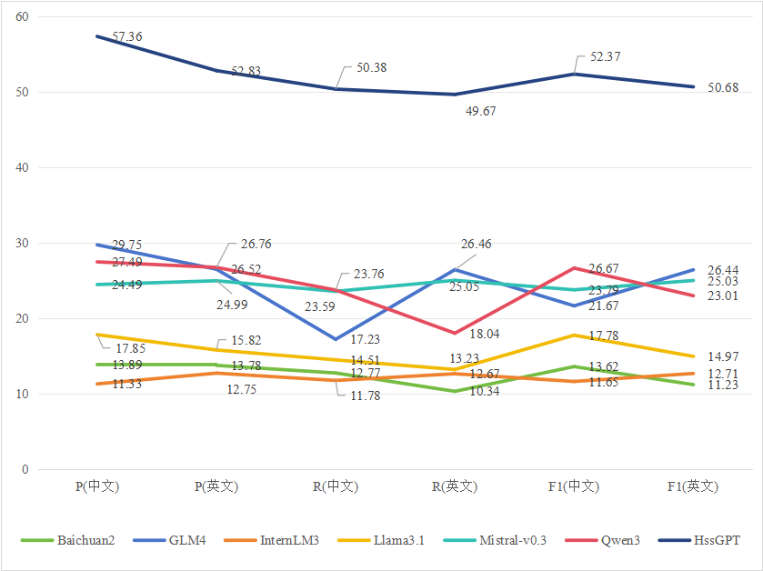
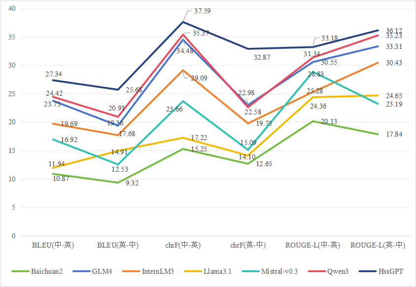

# HssGPT
大语言模型赋能是人文社会科学创新发展的强大动力，而领域化大语言模型构建是两者结合的必要前提。为解决人文社会科学学术领域垂直大语言模型缺失的问题，本研究构建了目前规模最大的人文社会科学学术数据集。在所构建的数据集基础上，结合人文社会科学的领域特色，制定了专用的大语言模型评价体系，并以性能较为优越的Qwen3为基座大语言模型构建了人文社会科学学术大语言模型。该模型的构建为大语言模型赋能人文社会科学的发展奠定了坚实的基础，为跨学科研究提供了有力的数据支持和智能方法论指引，从而有利于促进新文科朝着更加数据化、信息化和智能化的方向发展。

## 评价基准
为选取性能优越的通用大模型作为基线模型，本研制定了面向人文社会科学学术领域的评价体系，基于该体系，针对不同任务构建了多个评价指标。

## 训练数据
* 继续预训练
本研究构建的人文社会科学学术大语言模型训练数据集来源分为中文和英文两个部分。中文数据包括来源于中文社会科学引文索引（CSSCI）和人大复印报刊资料的题录和学术全文本。英文数据包括来源于Web of Science核心数据库的SSCI、A&HCI期刊论文摘要、MUSE和Gutenberg的图书文本数据以及英文学术论文的全文本数据。从大语言模型的词元（Token）角度度量，本研究构建的数据集总规模达到约109.7亿词元 ，为目前规模最大、学科覆盖最完整和时间跨度最长的人文社会科学学术语料数据集。
* 指令微调数据集
为进一步提升HssGPT-Base在人文社会科学学术研究场景下的实际应用价值，本研究针对人文社科研究的学科分类、语步识别、术语抽取与分类和文本翻译等任务，构建了高质量的多任务指令微调数据集,见[此处](./hss_sft.json)。

## 性能评估
* 学科分类

* 语步识别

* 术语抽取与分类

* 中英文献翻译

## 模型开源地址
基座模型：[HssGPT](https://github.com/QwenLM/HssGPT)
指令模型：[HssGPT](https://huggingface.co/Qwen/Qwen-14B-Chat-HssGPT-Base)